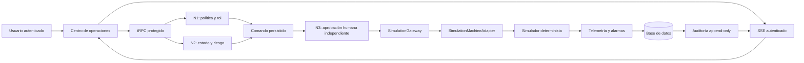

# NEXUS Machine Ops — Operación y arquitectura

## Estado de esta fase

NEXUS Machine Ops opera solo contra **Nexus Process Simulator 01** mediante `SimulationMachineAdapter`. El adaptador está encapsulado detrás de `SimulationGateway`, que acepta únicamente el modo `simulation`. No se incluyen controladores ni conexiones físicas. La plataforma no es una HMI certificada, no implementa una parada de emergencia física y no debe usarse como mecanismo de seguridad funcional.

## Arquitectura de ejecución



La consulta inicial se obtiene con tRPC. Después, un canal SSE autenticado invalida la vista cuando se registra una decisión o cambio auditado. La telemetría se genera al solicitar el snapshot del simulador; no existe un proceso persistente de control ni una comunicación con equipos externos.

## Roles operativos

| Rol | Observa | Prepara comandos | Aprueba comandos ajenos | Administra política |
|---|---:|---:|---:|---:|
| `observer` | Sí | No | No | No |
| `operator` | Sí | Sí, en alcance limitado | No | No |
| `approver` | Sí | No | Sí | No |
| `policy_admin` | Sí | Sí | Sí, nunca los propios | Sí |

Un administrador de la plataforma se trata como `policy_admin` para la evaluación de política. Aun así, la regla de independencia prohíbe aprobar la propia solicitud.

## Protocolo de triple confirmación

| Nodo | Evidencia persistida | Resultado que permite continuar | Resultado que bloquea |
|---|---|---|---|
| **N1 — Política y rol** | Rol efectivo, modo, versión de política y alcance | `allow` | Rol insuficiente, alcance no permitido o modo distinto de simulación |
| **N2 — Estado y riesgo** | Estado, temperatura, heartbeat, alarma crítica y telemetría | `allow` | Transición no válida, señal vencida, alarma crítica o umbral superado |
| **N3 — Aprobación humana** | Identidad del aprobador, vencimiento y decisión explícita | `approved` | Sin decisión, expiración, rol inadecuado o autoaprobación |

Los nodos N1 y N2 se evalúan al preparar el comando. Antes de la ejecución, N1 y N2 se vuelven a evaluar; por tanto, una aprobación previa no puede habilitar un cambio de rol, una alarma o un estado de simulación que haya cambiado. La aprobación expira cinco minutos después de la solicitud y está ligada a un `commandId` e `idempotencyKey` únicos.

## Estados del simulador y transiciones protegidas

| Estado | Operaciones permitidas |
|---|---|
| `stopped` | `start`, `enter_maintenance`, `acknowledge_alarm`, `emergency_stop_simulation` |
| `calibrating` | `stop`, `emergency_stop_simulation`, `acknowledge_alarm` |
| `operating` | `pause`, `stop`, `acknowledge_alarm`, `emergency_stop_simulation` |
| `paused` | `resume`, `stop`, `acknowledge_alarm`, `emergency_stop_simulation` |
| `maintenance` | `stop`, `exit_maintenance`, `acknowledge_alarm`, `emergency_stop_simulation` |
| `emergency` | `reset`, `acknowledge_alarm` |

La parada de emergencia simulada entra en `emergency` y activa la alarma `SIM_ESTOP_ACTIVE`. `reset` es la única recuperación funcional diseñada para esa alarma. Esto demuestra el flujo lógico y no sustituye una parada de emergencia independiente en un sistema físico.

## Auditoría y aprendizaje de fallos

Cada solicitud, validación, aprobación, rechazo, ejecución, alarma y recuperación genera un evento de auditoría. Las entradas se anexan, no se editan desde la aplicación, y están encadenadas mediante el hash de la entrada previa y el hash del contenido actual. Las tablas persistentes separan comandos, validaciones, eventos, telemetría, alarmas y bitácora de auditoría para permitir reconstruir una decisión.

| Registro | Pregunta que responde |
|---|---|
| `machineCommands` | ¿Qué se solicitó y cuál fue el estado final? |
| `commandValidations` | ¿Qué decidió cada nodo y por qué? |
| `machineEvents` | ¿Qué cambio operativo ocurrió? |
| `machineTelemetry` | ¿Qué señal observó el simulador? |
| `machineAlarms` | ¿Qué alarma se activó, reconoció o limpió? |
| `auditLog` | ¿Quién o qué decidió, en qué secuencia y con qué cadena de integridad? |

## Operación diaria en simulación

El operador inicia sesión, revisa la telemetría y solicita una acción desde el Command Center. Si N1 o N2 bloquean la solicitud, no se abre una ruta de ejecución. Si ambos permiten, el comando queda en `awaiting_human`. Un aprobador distinto del solicitante revisa la operación y la aprueba o rechaza. Tras una aprobación válida, el gateway de simulación realiza la transición protegida, persiste el resultado y publica una actualización SSE.

Para probar la independencia, use cuentas distintas: una con rol operativo para solicitar y otra con `approver` o `policy_admin` para aprobar. La autoaprobación se registra y bloquea de manera explícita.

## Comprobaciones del proyecto

```bash
pnpm check
pnpm test
pnpm build
```

Las pruebas cubren política y roles, rechazo por estado inseguro, completitud de los tres nodos, autoaprobación, expiración, gateway de simulación, alarmas y encadenamiento de hashes de auditoría.

## Condiciones para una futura integración física

Una conexión física requiere una iniciativa de ingeniería separada. No basta con implementar una clase nueva de adaptador. Antes de habilitarla se necesitan, como mínimo, un adaptador específico del fabricante, análisis de riesgo, segmentación de red, identidad de dispositivos, pruebas de degradación, revisión de cambios, procedimientos de recuperación, responsables designados y una seguridad física independiente del software de supervisión. Solo después de documentar y verificar esos controles podría evaluarse una nueva fase.
