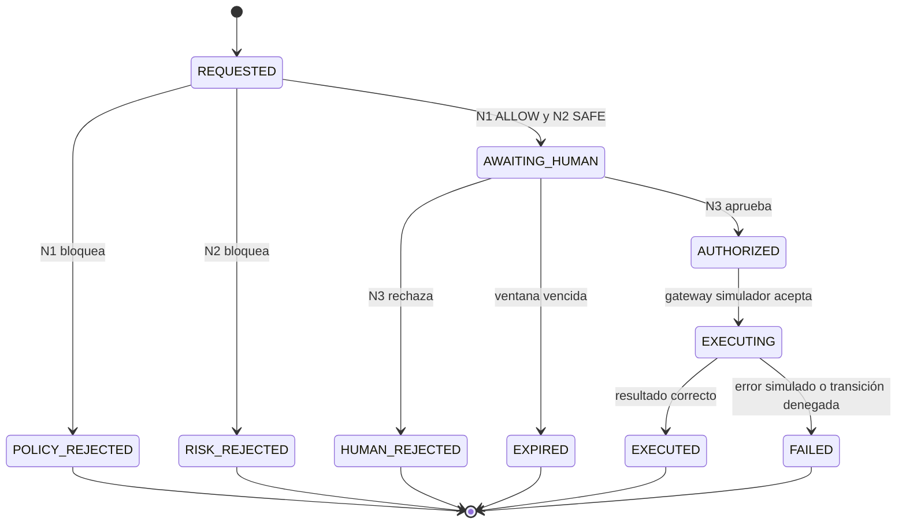

# Protocolo de Triple Confirmación — NEXUS Machine Ops

## Propósito y límite de fase

NEXUS Machine Ops funciona **exclusivamente con una máquina simulada**. El gateway de esta fase solo puede comunicarse con el simulador determinista incluido en la plataforma. No existe adaptador de PLC, OPC UA, Modbus, MQTT, serie, TCP ni ningún otro canal hacia hardware físico. La interfaz web nunca se conecta de forma directa a un equipo.

Las órdenes críticas se bloquean por defecto. Solo pueden pasar a ejecución simulada cuando los tres nodos de decisión independientes devuelven una autorización válida dentro de la misma ventana temporal. Un resultado negativo, vencido, ausente, inconsistente o no verificable en cualquiera de los nodos produce un bloqueo terminal y una entrada de auditoría.

## Roles

| Rol | Puede observar | Puede preparar | Puede aprobar | Puede administrar políticas |
|---|---:|---:|---:|---:|
| Observador | Sí | No | No | No |
| Operador | Sí | Sí | No | No |
| Aprobador | Sí | No | Sí | No |
| Administrador | Sí | Sí | Sí | Sí |

La aplicación conserva los cuatro roles como capacidades explícitas. En la plantilla inicial, el rol administrativo existente habilita la administración; los demás roles se modelarán como permisos operativos del dominio antes de exponer acciones de alto impacto.

## Los tres nodos independientes

| Nodo | Pregunta que contesta | Entrada | Resultado válido | Causa de bloqueo |
|---|---|---|---|---|
| **N1 — Política y rol** | ¿La persona solicitante puede pedir esta orden y la política admite prepararla? | Identidad, rol, tipo de comando, modo y alcance | `ALLOW` con versión de política | Rol insuficiente, comando prohibido, modo distinto de simulación o alcance fuera de contrato |
| **N2 — Estado y riesgo** | ¿La transición es segura dentro del simulador ahora? | Estado actual, alarmas, telemetría, transición, precondiciones | `SAFE` con snapshot del estado | Estado no compatible, alarma crítica, telemetría fuera de umbral, latido vencido o transición inválida |
| **N3 — Aprobación humana** | ¿Una persona autorizada revisó conscientemente la operación preparada? | Resumen, impacto, command ID, token de aprobación y vencimiento | `APPROVED` por un aprobador distinto del solicitante cuando la política lo exija | Falta de aprobación, autoaprobación prohibida, token vencido, identidad incorrecta o rechazo explícito |

## Flujo de estados del comando

## Invariantes no negociables

La aplicación debe rechazar comandos en duplicado usando una clave de idempotencia. Los nodos N1 y N2 se recalculan inmediatamente antes de ejecutar, por lo que una aprobación humana no puede autorizar un estado que ya cambió. La aprobación tiene vencimiento breve y queda ligada a un `commandId`, al hash de parámetros y al snapshot de riesgo. Cualquier modificación del comando invalida la aprobación existente.

El registro de auditoría es append-only a nivel de aplicación. Cada entrada incluye secuencia, hash de la entrada previa, hash del contenido, actor, rol, comando, nodo, decisión, motivo, marca temporal UTC, estado anterior y estado posterior. La interfaz no expone edición ni eliminación de esta bitácora.

Las acciones de borrado, cambios de permisos, secretos, gastos, despliegues y cualquier control físico real están clasificadas como **HUMAN_ONLY** y el gateway de simulación las rechaza por contrato. La parada de emergencia del simulador representa únicamente una transición lógica de demostración; no constituye un E-STOP industrial y no debe interpretarse como control de seguridad funcional.

## Criterios para una futura integración física certificada

Una futura integración física no se habilita con un cambio de configuración. Exige un proyecto de ingeniería separado con análisis de riesgos, adaptador específico validado por fabricante, segmentación de red industrial, gestión de certificados, pruebas de integración y degradación segura, procedimientos de cambio, revisión de seguridad funcional y una parada de emergencia independiente del software de supervisión. Hasta que esos criterios estén documentados, aprobados y verificados, el único adaptador permitido es el simulador.
